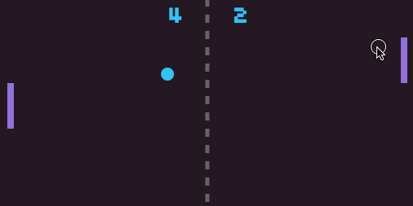

# Pong Game

A basic kitten themed pong game using SVGs. Some features include sound effects, ball change to a kitten ball at point 5, and winner at point 10. 

## Setup

**Install dependencies:**

`> npm i`

**Run locally with Webpack Dev Server:**

`> npm start`

**Build for production:**

`> npm run build`

## Keys

**Player 1:**
* a: up
* z: down

**Player 2:**
* ▲ : up
* ▼: down

SPACE : pause

## Technologies Used

Entire game coded using object oriented javascript. 
Utilized webpack for compiling the css and javascript.

## License

[MIT](LICENSE)
